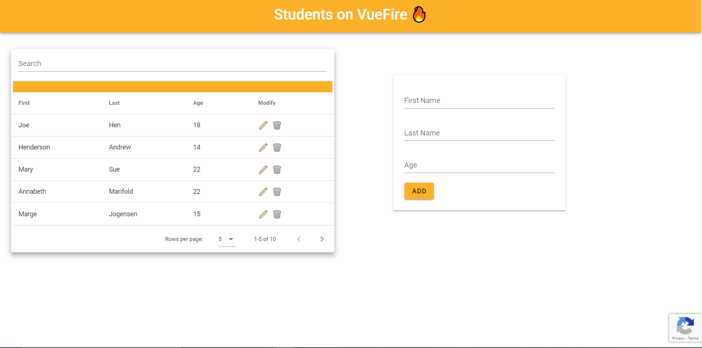
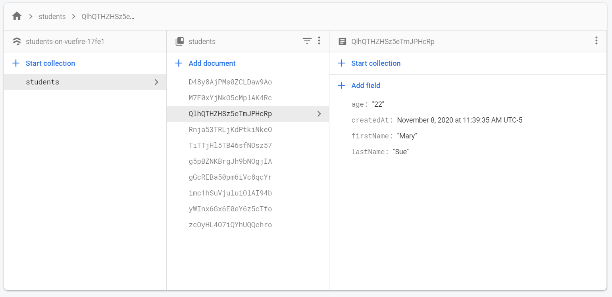

# Students_on_VueFire
A small app to display a table of imaginary students, stored in a cloud database, with CRUD functionality

## Technology
	
* HTML
* JavaScript
* CSS
* Vue
* VueCaptcha
* Google reCaptcha
* Cloud Firestore
* VueFire
* Vuetify
* Cloud Functions

Front-End




Database on Firestore



## Install

```sh
npm install
```

## Usage

```sh
npm run serve
```

## Author

👤 **Ethan Byrd**

* Website: www.ethanmbyrd.com
* Github: [@Ebyrd10](https://github.com/Ebyrd10)
* LinkedIn: [@Ethan-byrd](https://linkedin.com/in/Ethan-byrd)

- Website at <a href="http://www.Ethanmbyrd.com" target="_blank">`Ethanmbyrd.com`</a>
- LinkdenIn at <a href="https://www.linkedin.com/in/ethan-byrd/" target="_blank">`https://www.linkedin.com/in/ethan-byrd/`</a>

---

## License

[](http://badges.mit-license.org)

- **[MIT license](http://opensource.org/licenses/mit-license.php)**
